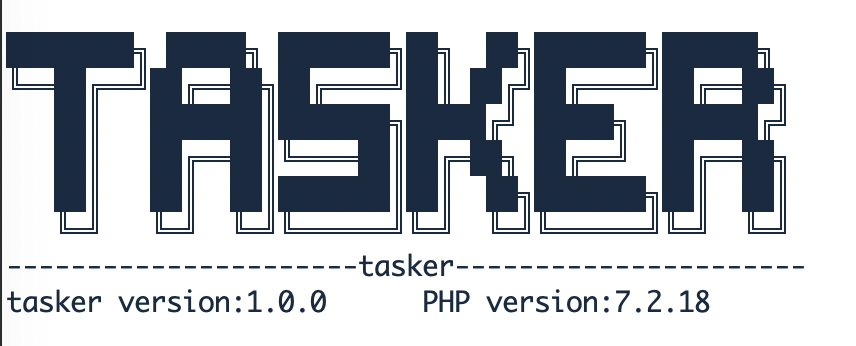

# php消息队列

------
## 获取代码
###git获取

>git clone git@github.com:ljk123/tasker.git

###composer获取
>todo

 
## 运行
### 代码
~~~
use tasker\Tasker;
Tasker::run()
~~~

### 启动

~~~
 php /yourpayh/start.php start
~~~

#### 其他命令
~~~
Usage: Commands
Commands:

start           Start worker.
restart         Start master.
stop            Stop worker.
reload          Reload worker.
status          Worker status.
                -s speed info
                -t time info
                -c count info
                -m count info

Use "--help" for more information about a command.
~~~

## 配置
~~~
 [
    'worker_nums'=>2,//开启worker进程数量
    'pid_path'=>'/var/run/fxf_task.pid',//主进程pid保存位置
    'stdout_path'=>null,//日志保存目录 为null表示不记录 为空表示当前启动目录
    'master_title'=>'task_master_process',//主进程名
    'worker_title'=>'task_worker_process',//子进程名
    'tasker_user'=>'www',//子进程运行权限 （可能导致权限不足）
    'stop_worker_timeout'=>5,//关闭子进程超时时间 超过这个时间 会强制结束
    'hot_update_path'=>[//要监听热更新的目录 会重启worker进程 生产环境慎用

    ],
    'hot_update_interval'=>5,//热更新目录检查间隔 秒
    'workering_time'=>0,//每个进程最多运行多久重启进程 主要防止上游redis或者mysql保持链接被踢掉
    'keep_workering_callback'=>null,//上游创建redis 或者mysql链接 为了保持链接执行的回调 下层通过call_user_function调用
    'keep_workering_ping_interval'=>600,//上游创建redis 或者mysql链接 为了保持链接 每隔多少秒执行一次回调 配和keep_workering_callback使用
    'retry_count'=>10,//任务失败 重试次数

    'gc_table_day'=>null,//table 保存几天的成功数据 防止表过大 null为不删除

    'database'=>[
        'host'=>'127.0.0.1',
        'db'=>'task',
        'user'=>'task',
        'pwd'=>'123456',
        'port'=>3306,
        'table'=>'task',
        'charset'=>'utf8'
    ],
    'redis'=>[
        'host'=>'127.0.0.1',
        'port'=>6379,
        'db'=>0,
        'pwd'=>'',
        'queue_key'=>'task'
    ]
];
~~~
>运行时候可进行配置
>~~~
>
>Tasker::run([
>   //传入配置
>    'worker_nums'=>4,
>    'hot_update_path'=>[
>        dirname(__FILE__)
>    ],
>    'keep_workering_callback'=>[\tests\Tasker_test::class,'keep'],
>    'gc_table_day'=>2,
>]);
>~~~

### 发布任务
>发布任务时也需要进行配置，主要配置数据库部分
>~~~
>Tasker::cfg([
>     'database'=>[
>         'host'=>'127.0.0.1',
>         'db'=>'task',
>         'user'=>'task',
>         'pwd'=>'123456',
>         'port'=>3306,
>         'table'=>'task',
>         'charset'=>'utf8'
>     ],
> ]);
>//Tasker::push(
>           string 类名,
>           string 方法名,
>           array 参数 （默认空数组）,
>           int 执行时间（默认立即执行）,
>           bool 是否检测重复发布（默认检测）
>);
>Tasker::push(\tests\Tasker_test::class,'test');//发布任务
>~~~
>
### 任务类说明
>```
>任务类跟普通类没有区别，方法可为静态可为动态，程序自动判断调用
>传参方式为call_user_function($callback,...$param)
>如:
>class A{
>   public function taskA($a,$b){
>       echo $a,$b;
>       //注意 
>       //注意 
>       //注意 三遍
>       //此任务是在事务中执行，所以不需要重复开启事务
>       //此方法里禁止调用exit、die、while(1){没break}等等造成阻塞或者结束进程的方法
>       //exit、die会导致任务无法完成
>       //死循环会导致任务无法执行其他任务，进程一直卡死在这里
>       
>   }
>}
>发布方式为
>Tasker::push(A::class,'taskA',['valueA','valueB']);
>任务输出 valueAvalueB
>
>
>如果任务执行成功，方法不需要操作
>如果执行失败，方法返回false 任务将重新添加至任务队尾，并且标记失败次数 如果失败次数超过配置retry_count，则不继续执行了
>如果抛出异常 任务将把关键异常信息记录在exception字段中 并且重试次数更新为99
>```

### 代码实例

>在thinkphp3.2中使用 [点我查看](example/thinkphp3.2)

>在thinkphp5中使用 [点我查看](example/thinkphp5)